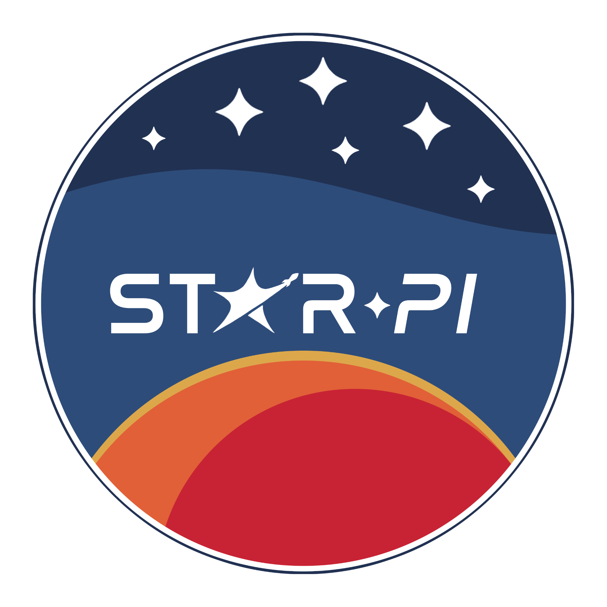

# MCU

**StarPi - Dipartimento di Avionaca**

## Introduzione

L'MCU usato è l'[`esp32-s3-wroom-1`](docs/esp32-s3-wroom-1_wroom-1u_datasheet_en.pdf) su framework Arduino.

> [!TIP]
> Consiglio l'uso dell'[ESP32-S3-DevKitC-1](https://docs.espressif.com/projects/esp-dev-kits/en/latest/esp32s3/esp32-s3-devkitc-1/user_guide_v1.1.html)
> in quanto oltre a dare pin di GPIO già saldati, ha un probe di debug integrato[^1]
> ed è quindi da subito pronto per il debug, senza troppi problemi[^2].

[^1]: [PlatformIO - ESP32-S3-DevKitC-1-N8](https://docs.platformio.org/en/latest/boards/espressif32/esp32-s3-devkitc-1.html#debugging).
[^2]: Su Fedora 43 (Linux) ho dovuto prima installare le [regole udev](https://docs.platformio.org/en/latest/core/installation/udev-rules.html)
e poi aggiornare una delle librerie di Python usate dal package dell'ESP32-S3
seguendo [questa guida](https://community.platformio.org/t/debug-aborts-with-python-error/41139/3).

Ambiente di sviluppo: [PlatformIO (VSCode)](https://platformio.org/platformio-ide).

## Struttura

Il progetto è strutturato in questo modo:

* `examples/`: cartella con esempi di codice per testare le funzionalità dell'MCU,
e di altri componenti.
