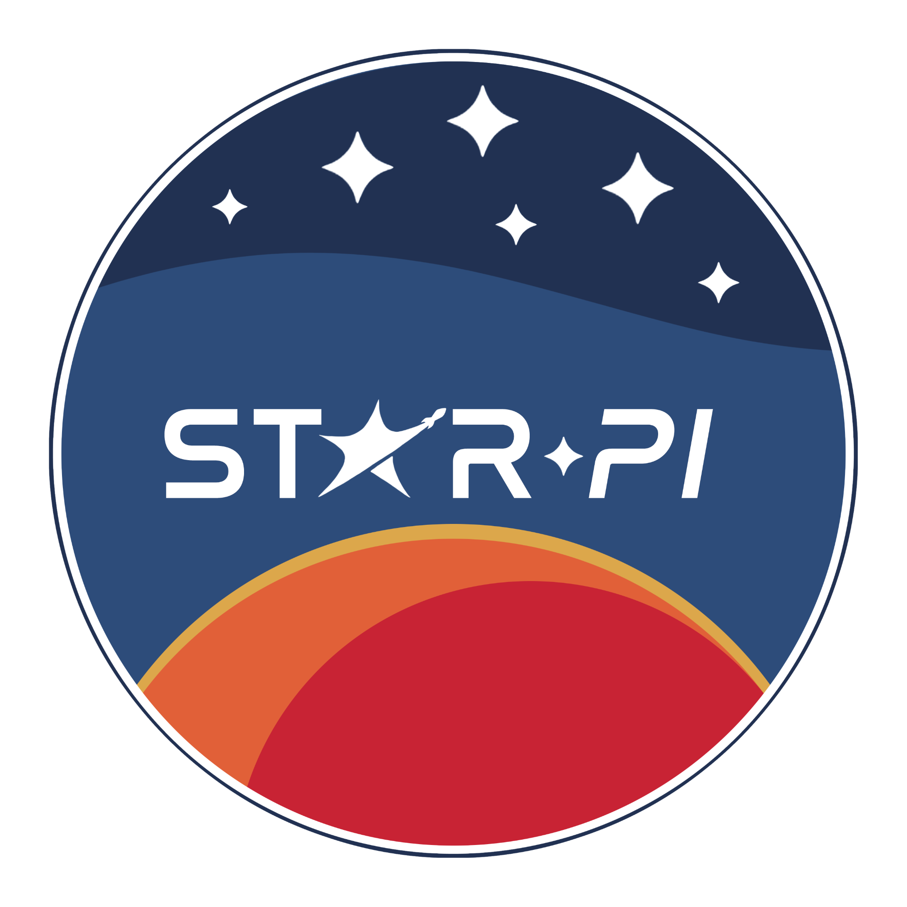

# MCU

**StarPi - Avionics Department**

## Introduction

The MCU used is the [`esp32-s3-wroom-1`](docs/esp32-s3-wroom-1_wroom-1u_datasheet_en.pdf) on the Arduino framework.

> [!TIP]
> We recommend using the [ESP32-S3-DevKitC-1](https://docs.espressif.com/projects/esp-dev-kits/en/latest/esp32s3/esp32-s3-devkitc-1/user_guide_v1.1.html)
> because, in addition to providing pre-soldered GPIO pins, it has an integrated debug probe[^1],
> making it ready for debugging out of the box with minimal hassle[^2].

[^1]: [PlatformIO - ESP32-S3-DevKitC-1-N8](https://docs.platformio.org/en/latest/boards/espressif32/esp32-s3-devkitc-1.html#debugging).
[^2]: On Fedora 43 (Linux), it may be necessary to first install the [udev rules](https://docs.platformio.org/en/latest/core/installation/udev-rules.html)
and then update one of the Python libraries used by the ESP32-S3 package
by following [this guide](https://community.platformio.org/t/debug-aborts-with-python-error/41139/3).

Development Environment: [PlatformIO (VSCode)](https://platformio.org/platformio-ide).

## Project Structure

The project is structured as follows:

* `app/`: The core application code and firmware entry points.
* `examples/`: Code examples to test the features of the MCU and other components.
* `test/`: Unit tests for the various modules and components.
* `docs/`: Relevant datasheets and documentation.

## Useful Resources

Useful resources for development:

* [Flight Computer Schematic](assets/schematic_flight_computer.pdf)
* [ESP32 Web Simulator (Wokwi)](https://wokwi.com/): allows you to simulate the MCU's behavior and test code without having to upload it physically to the device.
* [ESP32-S3 QEMU](https://docs.espressif.com/projects/esp-idf/en/latest/esp32s3/api-guides/tools/qemu.html): an emulator that allows running the MCU code on a computer, useful for local debugging and development.
